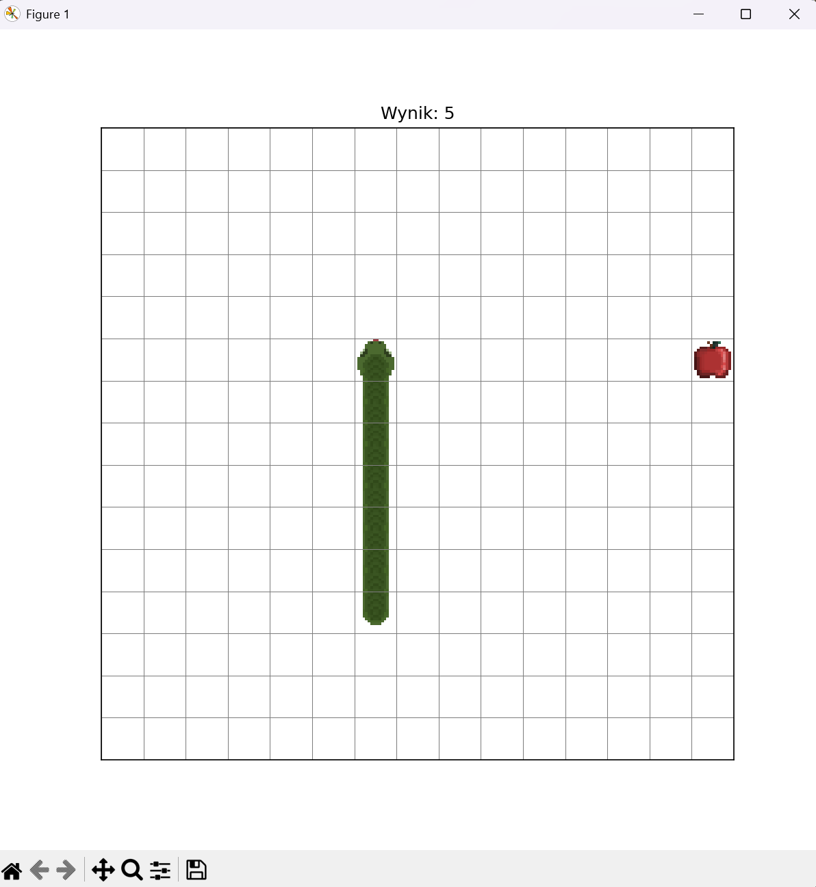

# 🐍 Custom Matplotlib Snake


A unique take on the classic Snake game, built entirely in Python! Instead of using traditional game engines like Pygame, this project creatively leverages the **Matplotlib** library to render graphics, handle custom textures, and manage the game loop/frame updates. 

Created as an extended task at the University of Wrocław.

## ✨ Features
* **Matplotlib Rendering:** Fully functional game loop using `FuncAnimation`.
* **Custom Textures:** Dynamic rendering of the snake's body (head, tail, corners, and belly) based on movement direction.
* **Score Tracking:** Real-time score updates displayed on the plot title.
* **Restart Mechanics:** Quick reset functionality after a Game Over without closing the window.

## 📸 Screenshot

## 🚀 Installation & Usage

This project uses modern Python packaging (`pyproject.toml`). You can install and run it with just a few commands.

**1. Clone the repository:**
```bash
git clone https://github.com/srodeknasenny/Custom-Snake-Game.git
cd Custom-Snake-Game
```
**2. Install the game**
This will automatically install the required dependencies (matplotlib).
```bash
pip install .
```
**3. Start the game**
```bash
play-snake
```
## 🎮 Controls
* W / Up Arrow - Move Up
* S / Down Arrow - Move Down
* A / Left Arrow - Move Left
* D / Right Arrow - Move Right
* R - Restart game (after Game Over)

## 🛠️ Technologies Built With
* Python - Core logic
* Matplotlib - Graphical interface and animation loop

---
Developed by Computer Science student at UWr.
